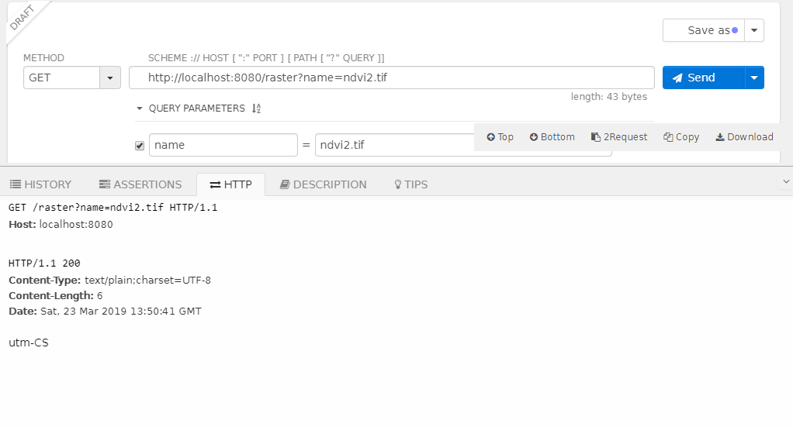
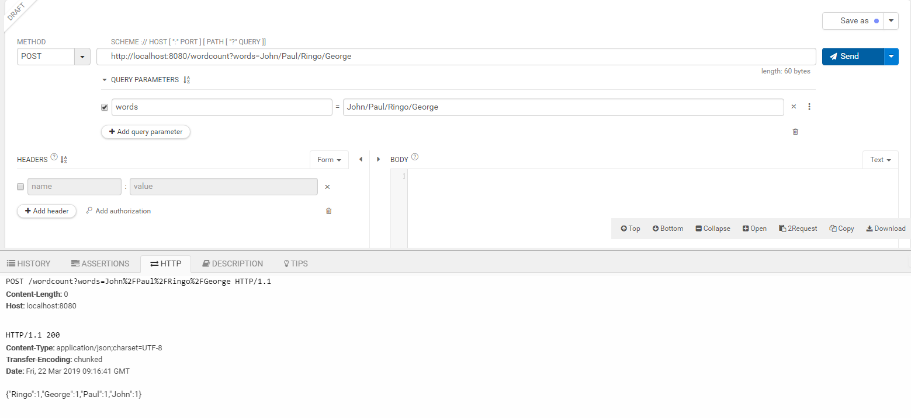

## SpringBoot-Spark-Scala  
springboot deployed with spark, programming with scala  

### example  
start the project: `mvn spring-boot:run`  
a **wordcount** Http service will be started at http://localhost:8080/wordcount  
we can use post method to send the params like below.
  

a raster crs service for .tiff data,the entry point at http://localhost:8080/raster
